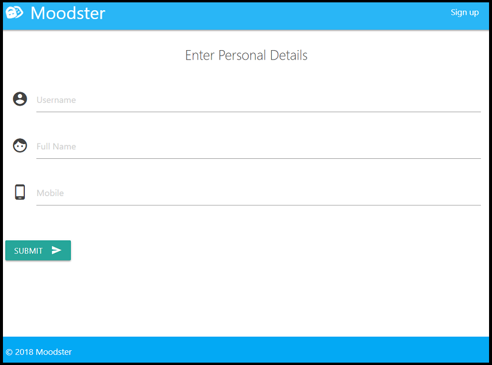
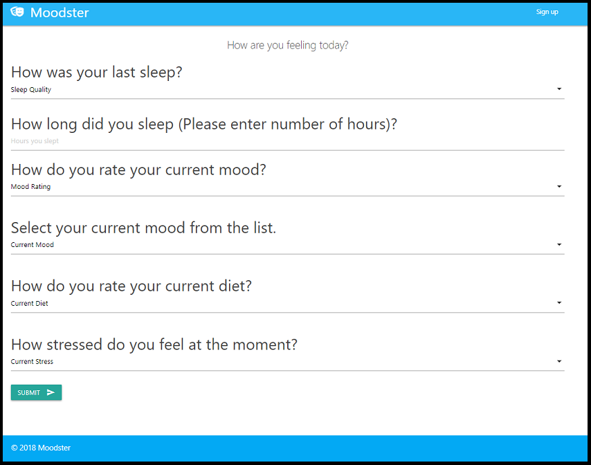
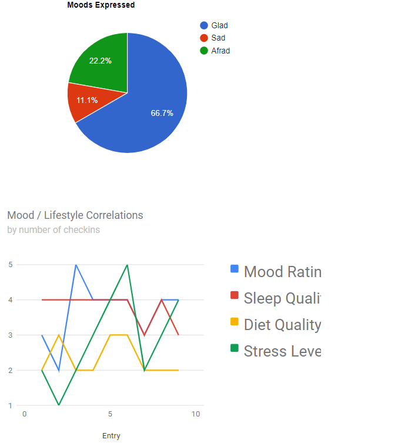

# Moodster
## A Mobile App for Mood Tracking and Visualization

Moodster is a full-stack web application. Users sign up for a unique account, and the app renders visuals of their mood, sleep and diet data using Google Charts. Using the Twilio Programmable SMS API and node-cron node.js task scheduler package, Moodster can also send text alerts to users reminding them to log in and make an entry.

Check it out on [Heroku!](https://moodster.herokuapp.com)

## Screenshots

Users can create an account with a unique username and SMS reminder capability...

Enter mood, sleep, and diet updates as often as they wish throughout the day...

...And see visual representations of their data over time.

## Built With

* Javascript and JQuery
* Node and Express - Web Server
* MySQL - Database
* Sequelize - ORM
* Materialize - Template
* [Twilio API](https://www.twilio.com/sms) - SMS alerts
* [Cron](https://www.npmjs.com/package/node-cron) - Node.js task scheduler for SMS messages
* [Google Charts](https://developers.google.com/chart/) - Create and display Moodster user data charts

## Authors

* **David Stocker** - [dbstocker](https://github.com/dbstocker)
* **James Wingo** - [wingojt](https://github.com/wingojt)
* **Jeremy Hancock** - [JeremyHancock](https://github.com/JeremyHancock)
* **Renée Grinnell** - [reneegrinnell](https://github.com/reneegrinnell)

## License

This project is licensed under the GNU General Public License - see the [LICENSE.md](LICENSE.md) file for details.

## Acknowledgments

* Shoutout to PurpleBooth for this fantastic [README template.](https://gist.github.com/PurpleBooth/109311bb0361f32d87a2#file-readme-template-md)
* Many thanks to our instructors and TAs at the University of Richmond Coding Bootcamp for their help and encouragement!
